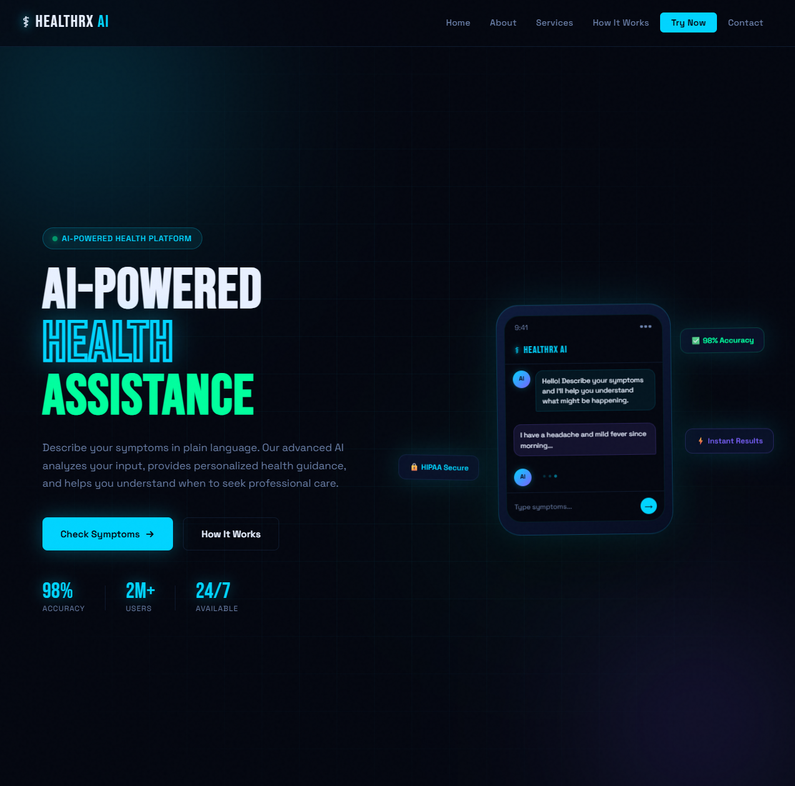
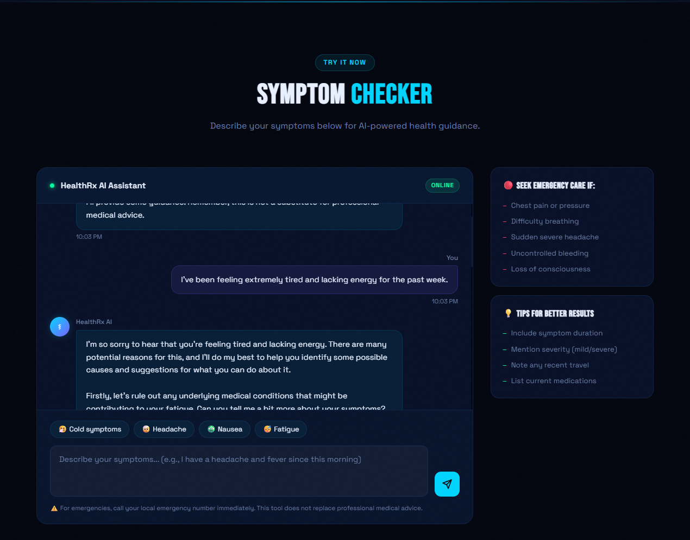

# 🩺 HealthRx AI

> An AI-powered symptom checker with a futuristic dark UI, real-time chat, and a secure FastAPI backend.

<div align="center">


</div>

---

## 🖥️ Screenshots

<div align="center">

### 🏠 Landing Page — Hero Section


*Futuristic dark UI with animated orbs, phone mockup, and live stats*

<br/>

### 💬 AI Symptom Checker — Live Chat


*Real-time AI responses via Groq API — routed securely through your FastAPI backend*

</div>

---

## ✨ Features

- 🤖 **AI Symptom Analysis** — Conversational symptom checker powered by Groq's blazing-fast LLM inference
- 🔒 **Secure Backend Routing** — All API calls proxied through FastAPI; no keys exposed to the client
- 🌑 **Futuristic Dark UI** — Animated hero section with orbs, glassmorphism cards, and smooth transitions
- 📊 **Live Stats Display** — Real-time health metrics and response data surfaced in the UI
- 📁 **Structured Logging** — All interactions logged under `logs/` for audit and debugging
- 📱 **Responsive Design** — Mobile-first frontend built in the `frontend/` directory

---

## 🗂️ Project Structure

```
healthrx-ai/
├── app/                  # FastAPI backend (routes, models, services)
├── data/                 # Static or reference health data
├── docs/                 # Screenshots and documentation assets
│   ├── hero.png
│   └── checker.png
├── frontend/             # Frontend source (HTML/CSS/JS or framework)
├── logs/                 # Runtime logs
├── .gitignore
├── requirements.txt
└── README.md
```

---

## 🚀 Getting Started

### Prerequisites

- Python 3.11+
- A [Groq API key](https://console.groq.com/)

### 1. Clone the repository

```bash
git clone https://github.com/your-username/healthrx-ai.git
cd healthrx-ai
```

### 2. Create a virtual environment

```bash
python -m venv venv
source venv/bin/activate        # macOS/Linux
venv\Scripts\activate           # Windows
```

### 3. Install dependencies

```bash
pip install -r requirements.txt
```

### 4. Set up environment variables

Create a `.env` file in the root directory:

```env
GROQ_API_KEY=your_groq_api_key_here
```

### 5. Run the backend

```bash
uvicorn app.main:app --reload
```

The API will be available at `http://localhost:8000`.

### 6. Open the frontend

Open `frontend/index.html` in your browser, or serve it with a local server:

```bash
npx serve frontend
```

---

## 🔌 API Endpoints

| Method | Endpoint | Description |
|--------|----------|-------------|
| `GET` | `/` | Health check |
| `POST` | `/chat` | Send a symptom message, receive AI response |

### Example request

```bash
curl -X POST http://localhost:8000/chat \
  -H "Content-Type: application/json" \
  -d '{"message": "I have a headache and fever for 2 days"}'
```

---

## ⚠️ Disclaimer

HealthRx AI is a **demonstration project** and is **not a substitute for professional medical advice, diagnosis, or treatment**. Always consult a qualified healthcare provider for medical concerns.

---

## 📄 License

This project is licensed under the [MIT License](LICENSE).
